##Prueba tecnica de Quind - Sistema de Alquiler de propiedades

# Property Rental System API

# Overview

This system provides endpoints to manage property rentals. It allows users to:

* Retrieve all properties.
* Search for properties within a value range.
* Add new properties. 
* Update existing properties. 
* Delete properties (with conditions). 
* Reserve properties for clients.

# Features

* Logging: Comprehensive logs for tracking and debugging. 
* Validation: Input validations to ensure data integrity.
* Transactional Operations: Key operations are transactional to maintain consistency.
* Error Handling: Detailed responses for various error scenarios.

# Prerequisites

* Java: Version 21.
* Spring Boot: Version 3.4.1
* Database: PostgreSQL.
* Maven: For managing dependencies.
* Docker: For containerization.

# Endpoints

## Properties Management

1. **Retrieve All Properties**

*GET /api/properties/all*

**Permit: All users**

Description: Fetches all available properties.

Response:

* 200 OK: List of properties. 
* 500 Internal Server Error: Unexpected error.

2. **Search Properties by Value Range**

*GET /api/properties/search*

*Permit: All users*

Parameters:

* minValue (int): Minimum property value. 
* maxValue (int): Maximum property value.

Response:

* 200 OK: Properties matching the range.
* 400 Bad Request: Invalid range values.
* 404 Not Found: No properties found in the range.

3. **Add New Property**

*POST /api/properties/save*

*Permit: Just Admin*

Parameters:

* propertyName (String): Name of the property.
* city (String): City where the property is located.
* address (String): Address of the property.
* mortgageValue (int): Property’s mortgage value.
* image (String): URL of the property image.

Response:

* 201 Created: Property created successfully.
* 403 Forbidden: Validation errors or constraints violations.
* 406 Not Acceptable: Location not allowed.
* 409 Conflict: Property already exists.

4. **Delete Property**

*PATCH /api/properties/delete*

*Permit: Just Admin*

Parameters:

* propertyName (String): Name of the property to delete.

Conditions:

* The property must not be rented.
* The property must be created more than 30 days ago.

Response:

* 200 OK: Property deleted successfully.
* 403 Forbidden: Property cannot be deleted.
* 404 Not Found: Property not found.

5. **Reserve Property**

*POST /api/properties/reserve*

*Permit: All users*

Parameters:

* propertyId (Long): ID of the property to reserve.
* clientDocument (Long): Document ID of the client reserving the property.

Conditions:

* The property must not be rented.
* The property must not be deleted.

Response:

* 200 OK: Property reserved successfully.
* 403 Forbidden: Property or client does not exist, or property not available.
* 500 Internal Server Error: Unexpected error.

6. **Update Property**

*PATCH /api/properties/update*

*Permit: Just Admin*

Parameters:

* propertyName (String): Current name of the property.
* newPropertyName (String): New name for the property.
* available (String): Availability status (“yes” or “no”).
* city (String): New city for the property.
* address (String): New address for the property.
* mortgageValue (int): Updated mortgage value.
* image (String): New image URL.

Conditions:

* If property is currently rented, propertyName, city and address can not be updated.

Response:

* 200 OK: Property updated successfully.
* 403 Forbidden: Validation errors or constraints violations.
* 404 Not Found: Property not found.
* 500 Internal Server Error: Unexpected error.

## Client Management

1. **Retrieve All Clients**

*GET /api/clients/all*

*Permit: Just Admin*

Description: Fetches all registered clients.

Response:

* 200 OK: List of clients.
* 500 Internal Server Error: Unexpected error.

2. **Search Client by Document**

*GET /api/clients/search*

*Permit: Just Admin*

Parameters:

* document (Long): Document ID of the client.

Response:

* 200 OK: Client details.
* 400 Bad Request: Invalid document value.
* 404 Not Found: Client not found.
* 500 Internal Server Error: Unexpected error.

3. **Add New Client**

*POST /api/clients/save*

*Permit: All users*

Parameters:

* firstName (String): First name of the client.
* secondName (String): Second name of the client.
* surName (String): Surname of the client.
* phoneNumber (String): Phone number of the client.
* email (String): Email address of the client.
* password (String): Password for the client.
* document (Long, optional): Document ID of the client.

Conditions:

* Client must not be registered.
* if customer's email domain contains @quind,they will be set to the administrator role.

Response:

* 200 OK: Client saved successfully.
* 400 Bad Request: Missing or invalid parameters.
* 403 Forbidden: Validation errors or constraints violations.
* 409 Conflict: Client already exists.
* 500 Internal Server Error: Unexpected error.

## Authentication

**Custom Authentication Entry Point**
*POST /api/auth/login*

*Permit: All users*

This component handles authentication exceptions.

## Logging

This API uses SLF4J with log levels:

* INFO: For successful operations.
* WARN: For validation warnings or potential issues.
* ERROR: For unexpected exceptions.

## Error Responses

*Standard error responses include:*

#### ErrorResponse:

{
"message": "Description of the error",
"details": "Detailed explanation or stack trace"
}

Running the Application

Clone the repository.

https://github.com/AndresT3009/AlquilerPropiedades

Configure the application.properties file for database connection:

spring.datasource.url=jdbc:postgresql://localhost:5432/property_rental
spring.datasource.username=prueba
spring.datasource.password=prueba_pass
spring.jpa.hibernate.ddl-auto=update

Build the project:

into the terminal:

* ./mvnw clean package -DskipTests
* docker-compose build alquileres-api
* docker-compose up

## Testing

1. *Save a Client*

You can register a client using the endpoint: 
http://localhost:8081/api/clients/save

This is the first step to use the app:

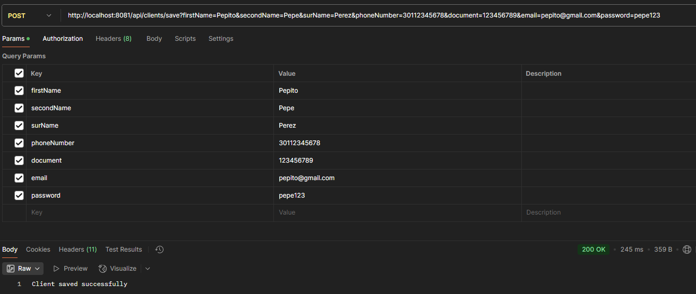

1. *Login*

Using the endpoint you obtain the access token, you don't need to copy and paste into the others request:
http://localhost:8081/api/auth/login

This token has a caducity of 10 minutes:

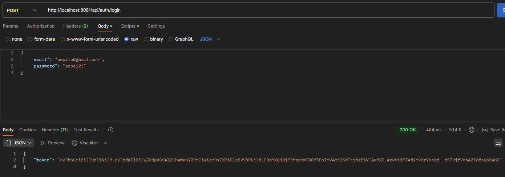

1.1 As general user you have access to search and reserve properties:

* All properties:
  http://localhost:8081/api/properties/all

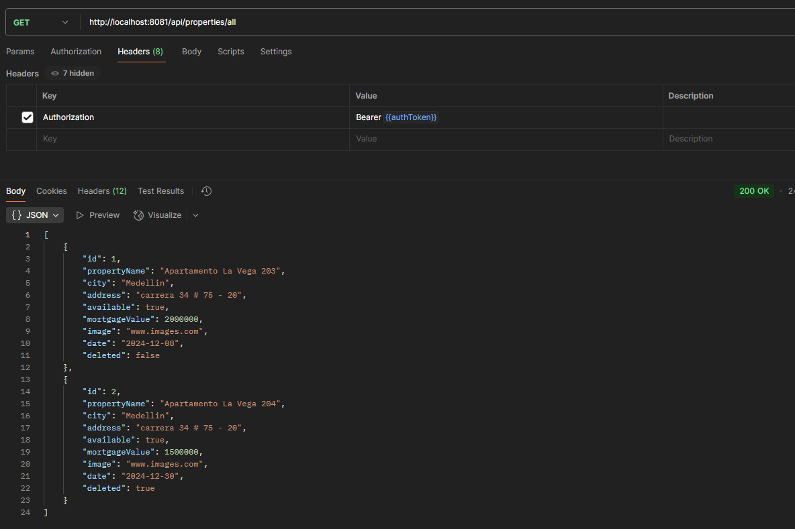

* Property by range value:
  http://localhost:8081/api/properties/search

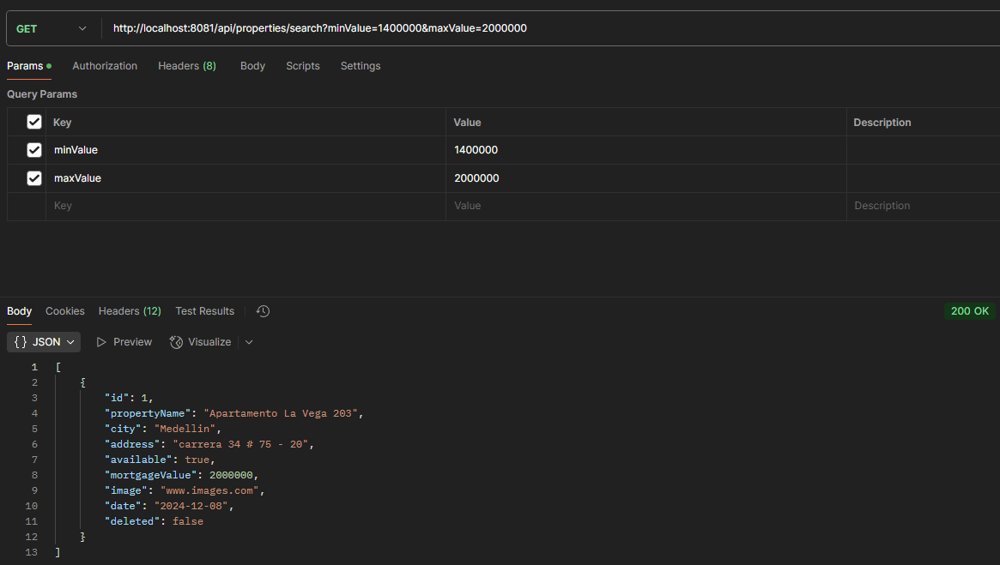

If you try to access to another endpoint with the general user, example: 
  http://localhost:8081/api/clients/all

you obtain a response like:

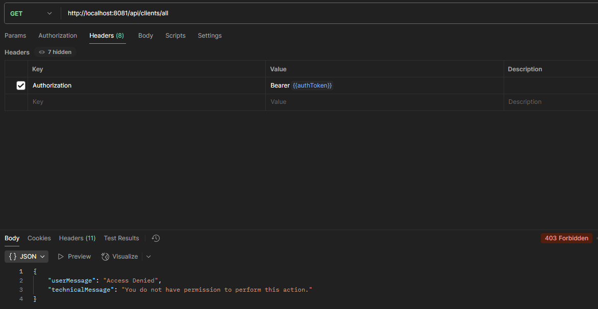

1.2 As Admin you have access to all services:

*Register new Admin:*

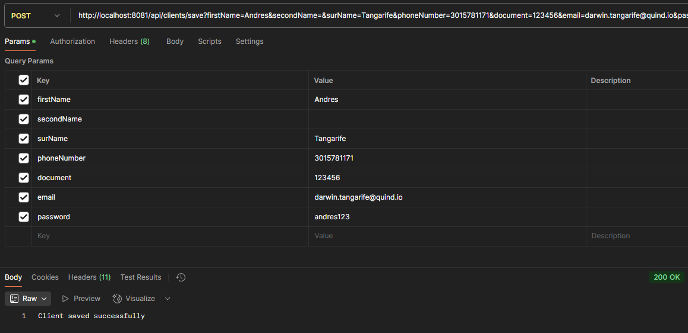

*Login:*

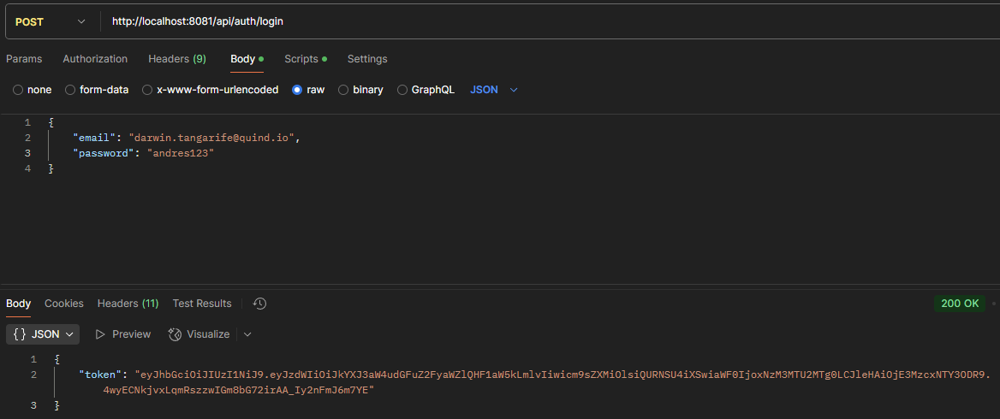

*All clients:*
  http://localhost:8081/api/clients/all

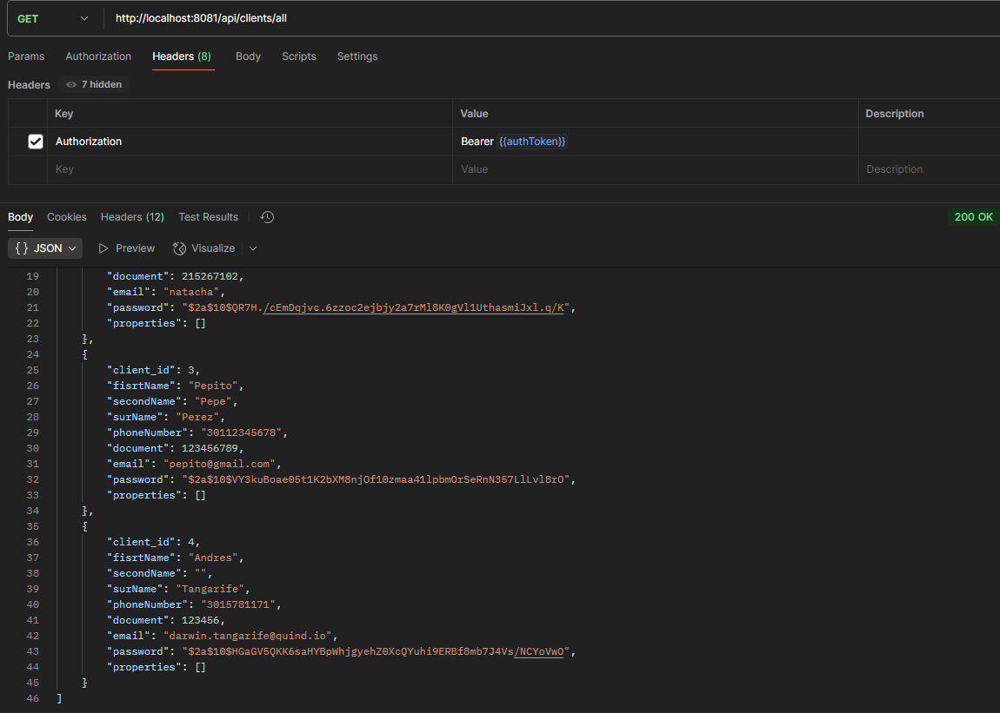

*Reserve property*
http://localhost:8081/api/properties/reserve

In the clientDocument field you must enter a valid user document. In the next image you can see the client assigned to property.

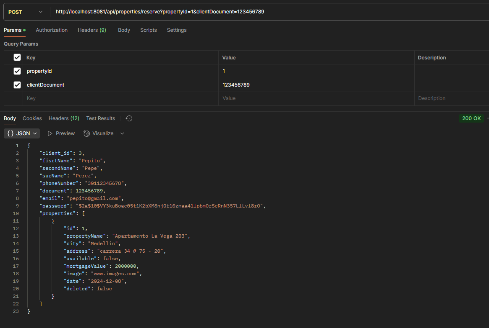

In the same way, if you go to search all clients, now you can see the property assigned to client:

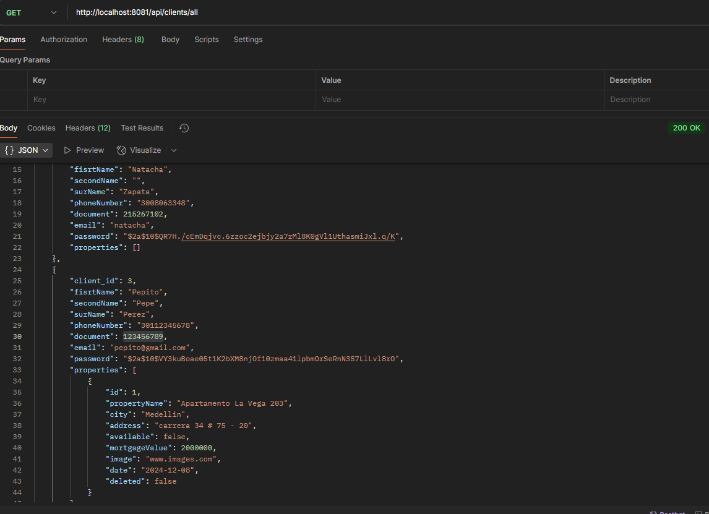

*Delete property*
http://localhost:8081/api/properties/delete

Write in the propertyName field, the name of the property you want to delete:

- If the property is currently rented (field available equals to false), you can´t delete it:

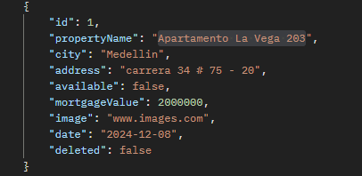
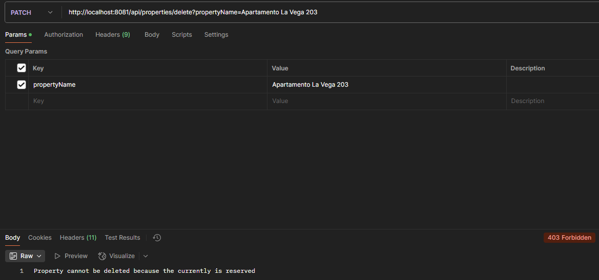

- If the property entry date is less than 30 days,it can´t be deleted:

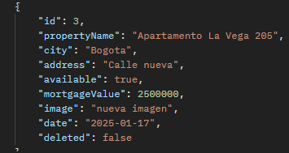
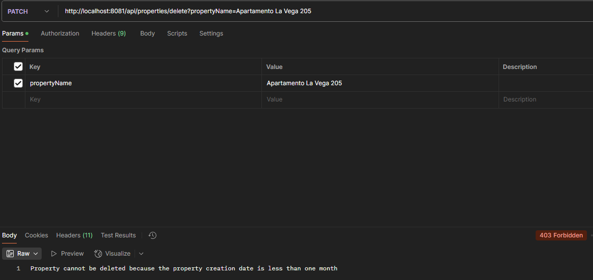

- However, if the property is available for rent and the entry date is more than 30 days ago, it can be deleted.

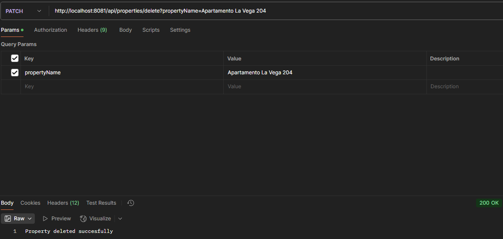

###### Now the field deleted was set to true, and is not posible to find when general user try to search by value:

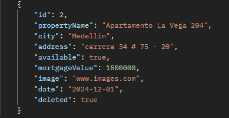

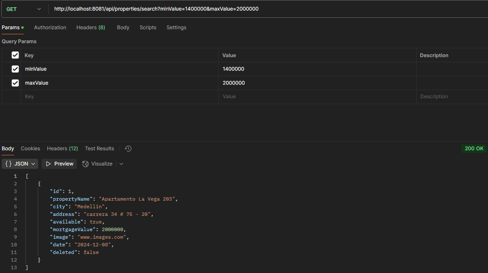

*Property register*
http://localhost:8081/api/properties/save

In the field city you only can insert Bogotá, Cali, Medellín and Cartagena, it does not matter lower case, upper case or accents:

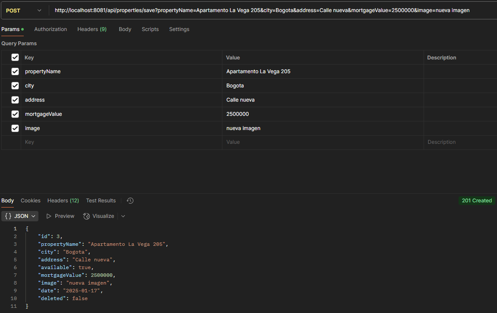

*Search client by document*
  http://localhost:8081/api/clients/search

Finally, you can search a client using its identity document:

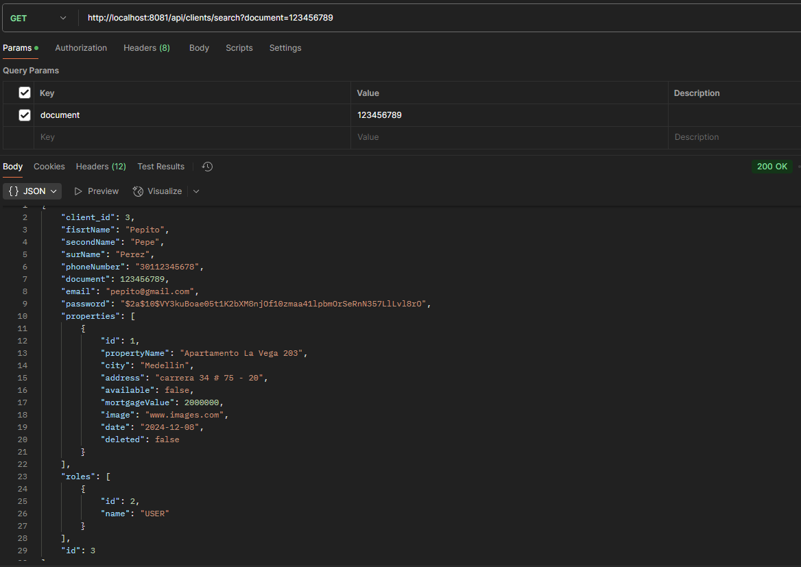

## Logs

Application has some logs to understand what happen at real time with requests

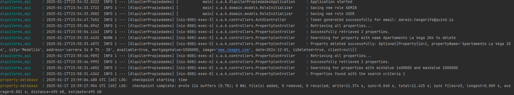

## Future Enhancements

* Enhance search functionality with filters like city, size, and amenities.

### Contributor:

*Darwin Andrés Tangarife Avendaño - Ingeniero de desarrollo*
